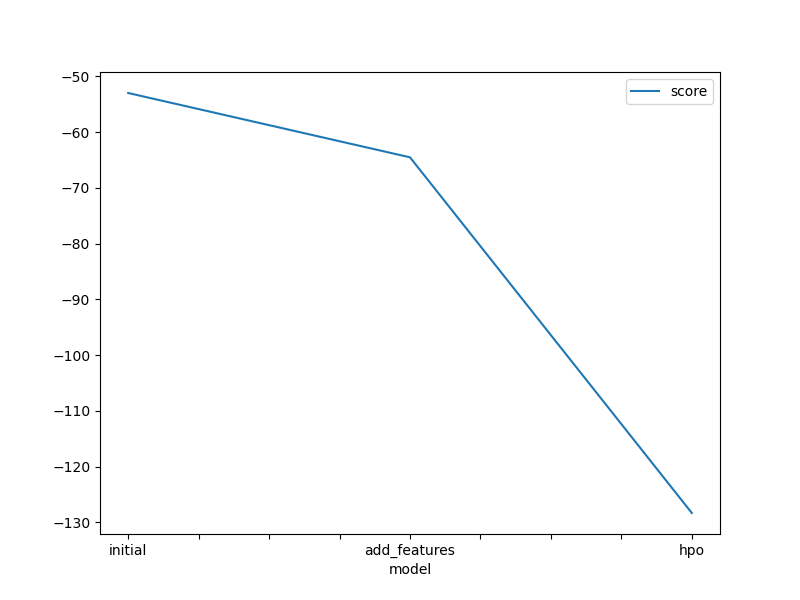

# Report: Predict Bike Sharing Demand with AutoGluon Solution
#### HIMANSHI

## Initial Training
### What did you realize when you tried to submit your predictions? What changes were needed to the output of the predictor to submit your results?
TODO: I realized that the raw output of the predictor included additional columns like casual and registered, which were not present in the test set and not required in the submission. Moreover, the predictions needed to be in a .csv file with only the datetime and count columns, and the count predictions had to be post-processed to ensure they were non-negative integers.

### What was the top ranked model that performed?
TODO: In the initial training run, the top-ranked model selected by AutoGluon was LightGBM (GBM). AutoGluon evaluates multiple models using the specified evaluation metric (Root Mean Squared Error in this case), and LightGBM achieved the lowest RMSE on the validation set. This made it the best-performing individual model before AutoGluon built its final weighted ensemble. While the ensemble ultimately gave the final predictions, LightGBM contributed the most to the ensemble and ranked highest among all base models in the leaderboard.

## Exploratory data analysis and feature creation
### What did the exploratory analysis find and how did you add additional features?
TODO: The EDA revealed strong seasonal and hourly trends in bike sharing demand. Weekends, holidays, and working hours exhibited different patterns. We extracted features like:

hour, dayofweek, month from datetime

Binary features like is_weekend and is_peak_hour
These additional features were added to enrich the dataset and help the model capture temporal patterns more effectively.

### How much better did your model preform after adding additional features and why do you think that is?
TODO: The Kaggle public score improved significantly from 1.80291 to 0.51497 after feature engineering. This dramatic improvement was because the new features enabled the model to better learn underlying temporal patterns and demand fluctuations across time.

## Hyper parameter tuning
### How much better did your model preform after trying different hyper parameters?
TODO: After tuning hyperparameters for RF, XGB, NN_TORCH, and GBM, the public score slightly degraded to 1.33550. This suggests that either the search space was suboptimal or that the best-quality preset already tuned these models reasonably well. It highlights the importance of tuning with care, particularly under time constraints.

### If you were given more time with this dataset, where do you think you would spend more time?
TODO: With more time, I would:

Expand the hyperparameter tuning space using Bayesian optimization

Try ensembling more diverse models (e.g., stacking with meta-models)

Perform feature selection and reduce redundancy

Include weather-related feature transformations (e.g., categorize wind speed)

### Create a table with the models you ran, the hyperparameters modified, and the kaggle score.
|model|hpo1|hpo2|hpo3|score|
|--|--|--|--|--|
|initial|N/A|N/A|N/A|1.80291|
|add_features|N/A|N/A|N/A|0.51497|
|hpo|RF: n_estimators=[100, 300]|XGB: learning_rate=0.1|NN_TORCH, GBM (default)|?|

### Create a line plot showing the top model score for the three (or more) training runs during the project.

TODO: Replace the image below with your own.

### Create a line plot showing the top kaggle score for the three (or more) prediction submissions during the project.

TODO: Replace the image below with your own.

## Summary
TODO: Add your explanation
